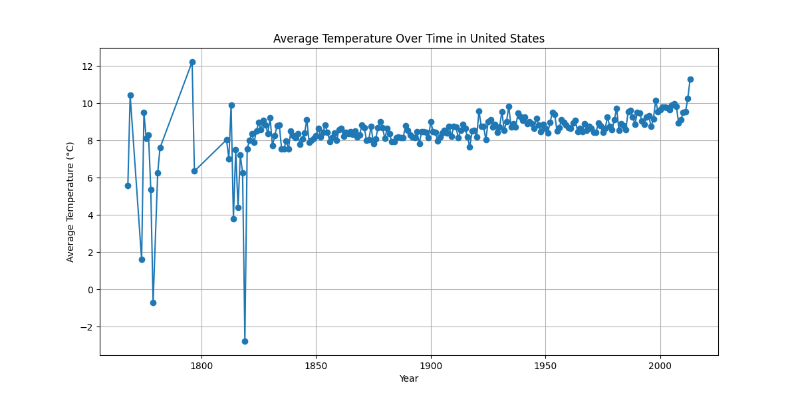
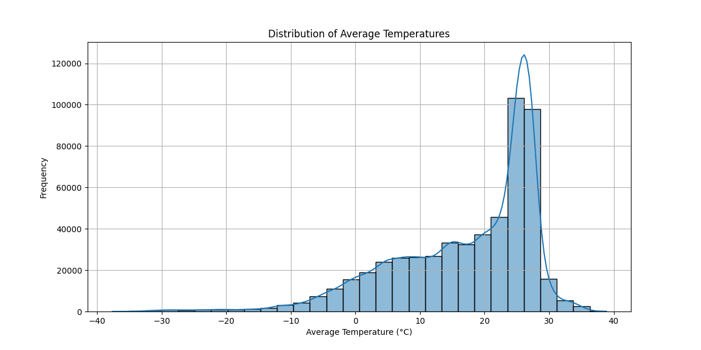
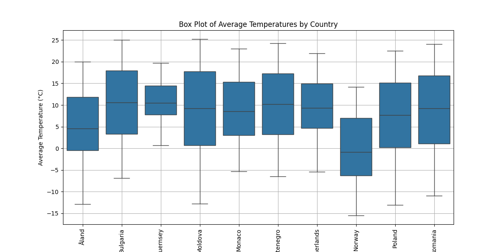
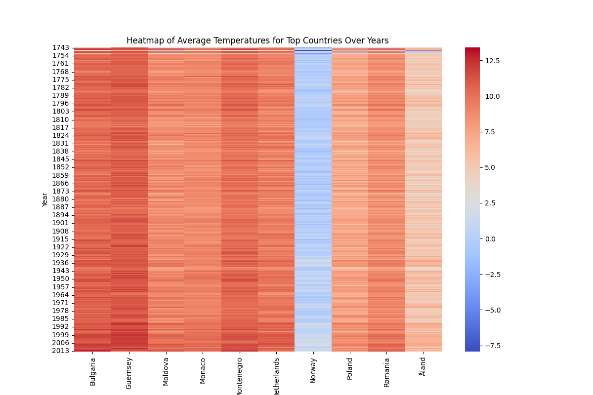

# Global Land Temperatures by Country - Exploratory Data Analysis

This EDA program analyzes and visualizes the Global Land Temperatures by Country dataset. The program performs data cleaning, generates multiple graphs, and summarizes key insights.

## Author
This program is written by Muhammad Yousaf.
Email: yousafsahiwal3@gmail.com

## Requirements
- pandas
- seaborn
- numpy
- matplotlib

## How to Run
1. Ensure you have the required libraries installed. You can install them using:
   ```bash
   pip install pandas seaborn numpy matplotlib
   ```
2. Place the `GlobalLandTemperaturesByCountry.csv` file in the same directory as the script.
3. Run the script using Python:
   ```bash
   python eda_program.py
   ```

## Dataset
The dataset contains global land temperatures by country, including average temperatures and other relevant information.

## Code Explanation

1. **Load and Clean the Dataset**
   - The dataset is loaded using `pandas`.
   - Missing values are dropped, and the `dt` column is converted to datetime format.

2. **Data Processing**
   - The year is extracted from the `dt` column.
   - The data is grouped by country and year to calculate the mean temperature for each group.

3. **Data Visualization**
   - Line plot of average temperature over time for a specific country.
   - Distribution of average temperatures using a histogram.
   - Box plot of average temperatures by country.
   - Heatmap of average temperatures for top countries over the years.

4. **Insights Summary**
   - Provides a brief summary of the key insights from the analysis.

## Generated Figures

1. **Average Temperature Over Time in the United States**
   

2. **Distribution of Average Temperatures**
   

3. **Box Plot of Average Temperatures by Country**
   

4. **Heatmap of Average Temperatures for Top Countries Over Years**
   

## Insights Summary
1. The dataset contains temperature records from the earliest date to the latest date in the dataset.
2. Missing values were found and dropped.
3. The average temperature over time can be visualized for specific countries.
4. The distribution of average temperatures shows a clear pattern.
5. Box plots and heatmaps reveal variations in temperatures across different countries and years.
```

This README file explains the purpose of the code, the required libraries, how to run the code, and includes placeholders for the generated figures. The figures will be saved as images in the same directory as the script when it is run.
